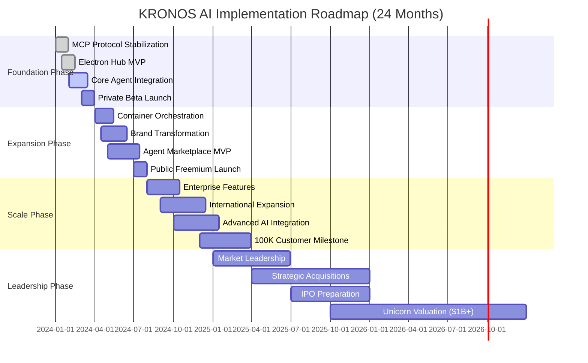
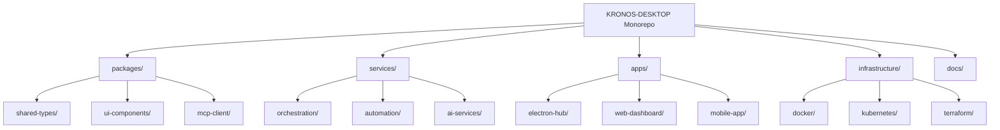
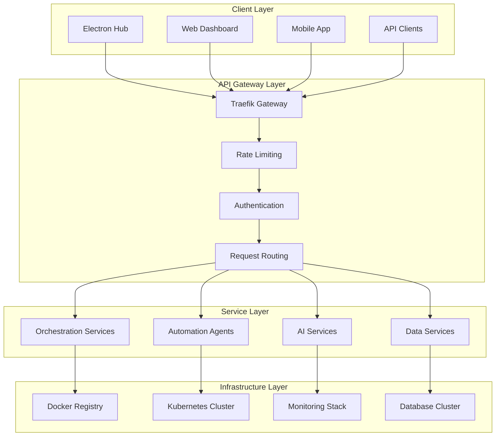
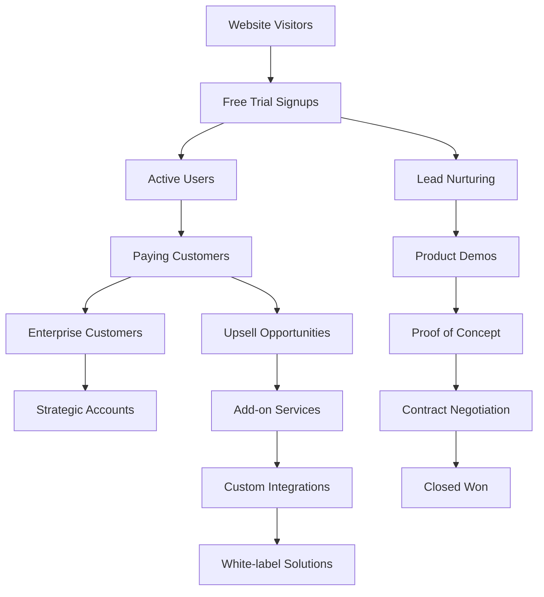
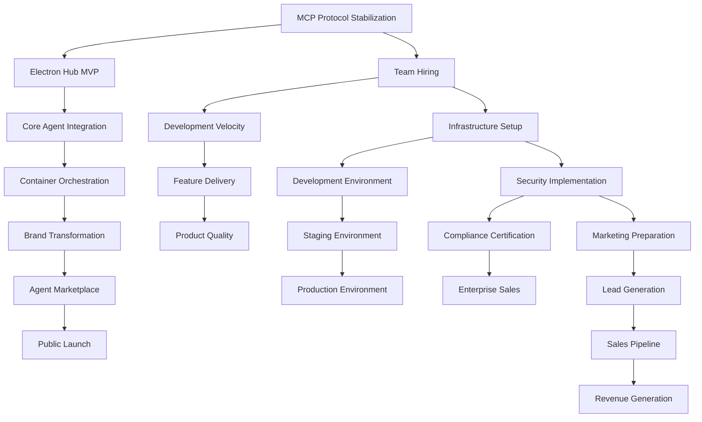

# KRONOS-DESKTOP Implementation Roadmap

## Executive Summary

### Vision
Transform KRONOS-DESKTOP from a sophisticated open-source monorepo into **Kronos AI**, the leading unified AI automation platform capturing 15% of the $2.4B AI automation market ($360M revenue potential) within 3 years.

### 3-Month Milestones (Q1 2024)
- **Technical**: MCP protocol stabilization, unified Electron hub MVP
- **Product**: Core automation agents (Instagram, OnlyFans, desktop control)
- **Business**: Private beta launch with 500 users, $50K MRR validation
- **Metrics**: 85% product-market fit score, 95% platform stability

### 6-Month Milestones (Q2 2024)
- **Technical**: Container orchestration standardization, 18 placeholder projects prioritized
- **Product**: Unified Kronos AI branding, agent marketplace foundation
- **Business**: Freemium public launch, 5,000 customers, $200K MRR
- **Metrics**: 40% month-over-month growth, <5% churn rate

### 12-Month Milestones (Q4 2024)
- **Technical**: Enterprise-grade scalability, SOC2 compliance
- **Product**: Full agent marketplace, white-label solutions
- **Business**: 50,000 customers, $2M MRR, enterprise sales pipeline
- **Metrics**: 99.9% uptime, 4.8/5 NPS, $150 CAC

## Implementation Timeline



## 1. Technical Consolidation Plan

### Monorepo Restructuring Strategy

#### Phase 1: Module Boundary Definition (Months 1-2)


**Deliverables:**
- Clear directory structure with 4 main categories
- Shared package extraction (UI components, types, MCP client)
- Service boundary definitions with API contracts
- Dependency mapping and circular import resolution

#### Phase 2: Service Extraction (Months 3-4)
- Extract 12 active services into independent containers
- Implement service mesh (Istio/Linkerd) for inter-service communication
- Establish contract testing between service boundaries
- Create shared infrastructure services (auth, logging, metrics)

### Unified API Gateway Implementation

#### Architecture Overview


#### Implementation Phases
1. **Month 1**: Kong/Traefik gateway deployment with basic routing
2. **Month 2**: Authentication middleware integration (JWT, OAuth)
3. **Month 3**: Rate limiting, request transformation, and response caching
4. **Month 4**: Service discovery integration and health check monitoring

### Container Orchestration Standardization

#### Docker Strategy
```yaml
# Standardized service template
version: '3.8'
services:
  service-name:
    build:
      context: ./services/service-name
      dockerfile: Dockerfile
    image: kronos/service-name:${TAG}
    environment:
      - NODE_ENV=${NODE_ENV}
      - SERVICE_PORT=${SERVICE_PORT}
    ports:
      - "${SERVICE_PORT}:${SERVICE_PORT}"
    depends_on:
      - database
      - redis
    healthcheck:
      test: ["CMD", "curl", "-f", "http://localhost:${SERVICE_PORT}/health"]
      interval: 30s
      timeout: 10s
      retries: 3
    networks:
      - kronos-network
    volumes:
      - service-data:/app/data
    restart: unless-stopped
```

#### Kubernetes Manifests
- **StatefulSets** for databases and persistent services
- **Deployments** for stateless application services
- **ConfigMaps** for environment-specific configuration
- **Secrets** for sensitive data management
- **Ingress** for external service exposure
- **HorizontalPodAutoscaler** for auto-scaling based on CPU/memory

### CI/CD Pipeline Consolidation

#### GitHub Actions Workflow
```yaml
name: KRONOS CI/CD Pipeline
on:
  push:
    branches: [main, develop]
  pull_request:
    branches: [main]

jobs:
  test:
    runs-on: ubuntu-latest
    strategy:
      matrix:
        service: [orchestrator, unified-platform, instapy, onlysnarf, wan2gp]
    steps:
      - uses: actions/checkout@v4
      - name: Test ${{ matrix.service }}
        run: |
          cd services/${{ matrix.service }}
          npm test  # or python -m pytest for Python services

  build-and-push:
    needs: test
    runs-on: ubuntu-latest
    steps:
      - name: Build and push Docker images
        run: |
          docker build -t kronos/${{ matrix.service }}:latest ./services/${{ matrix.service }}
          docker push kronos/${{ matrix.service }}:latest

  deploy-staging:
    needs: build-and-push
    environment: staging
    runs-on: ubuntu-latest
    steps:
      - name: Deploy to staging
        run: |
          kubectl apply -f k8s/staging/${{ matrix.service }}.yaml
          kubectl rollout status deployment/${{ matrix.service }}

  deploy-production:
    needs: deploy-staging
    environment: production
    runs-on: ubuntu-latest
    steps:
      - name: Deploy to production
        run: |
          kubectl apply -f k8s/production/${{ matrix.service }}.yaml
          kubectl rollout status deployment/${{ matrix.service }}
```

## 2. Product Unification Strategy

### Kronos AI Brand Implementation

#### Brand Identity System
```javascript
const kronosBrand = {
  name: 'Kronos AI',
  tagline: 'Intelligent Automation for the Modern Workforce',
  colors: {
    primary: '#00FF88',    // Electric green
    secondary: '#6366F1',  // Professional indigo
    accent: '#F59E0B',     // Energy amber
    neutral: '#1F2937'     // Trust gray
  },
  typography: {
    primary: 'Inter',
    secondary: 'JetBrains Mono',
    display: 'Cal Sans'
  },
  logo: {
    wordmark: 'KRONOS AI',
    icon: '⚡', // Lightning bolt for speed/intelligence
  }
}
```

#### Component Rebranding
```
OLD NAMES                          NEW KRONOS BRAND
━━━━━━━━━━━━━━━━━━━━━━━━━━━━━━━━━━━━━━━━━━━━━━━━━━━━
KRONOS-DESKTOP                     → Kronos AI Platform
unified-automation-platform        → Kronos Command Center
unified-ai-ecosystem              → Kronos AI Studio
ui-tars-desktop                   → Kronos Vision AI
open-computer-use                 → Kronos Computer Control
bytebot                            → Kronos Multi-Agent
instapy + instagrapi              → Kronos Social Suite
onlysnarf                         → Kronos Creator Studio
wan2gp                            → Kronos Video AI
gbox                              → Kronos Cloud Labs
factif-ai                         → Kronos QA Bot
```

### Unified Electron Application Architecture

#### Window Management System
```typescript
interface WindowManager {
  createWindow(config: WindowConfig): BrowserWindow;
  manageLayout(layout: LayoutConfig): void;
  persistState(): void;
  restoreState(): LayoutConfig;
}

interface WindowConfig {
  id: string;
  title: string;
  url: string;
  bounds: Rectangle;
  options: BrowserWindowConstructorOptions;
}

interface LayoutConfig {
  windows: WindowConfig[];
  tabs: TabConfig[];
  splitViews: SplitViewConfig[];
}
```

#### Application Discovery & Launch
```typescript
interface AppLauncher {
  discoverApps(): Promise<AppMetadata[]>;
  launchApp(appId: string, config: LaunchConfig): Promise<AppInstance>;
  manageLifecycle(instance: AppInstance): void;
  handleCommunication(instance: AppInstance): void;
}

interface AppMetadata {
  id: string;
  name: string;
  description: string;
  category: AppCategory;
  launchType: 'executable' | 'web' | 'container';
  icon: string;
  version: string;
}

interface LaunchConfig {
  mode: 'window' | 'tab' | 'split';
  position?: Rectangle;
  args?: string[];
  env?: Record<string, string>;
}
```

### Component Library Standardization

#### Design System Implementation
```typescript
// Shared component library structure
const componentLibrary = {
  atoms: {
    Button: 'Primary, Secondary, Ghost variants',
    Input: 'Text, Select, Checkbox, Radio',
    Icon: 'Lucide icon set with custom Kronos variants',
    Typography: 'Inter font scale with semantic variants'
  },
  molecules: {
    Card: 'Content containers with hover states',
    Modal: 'Dialog overlays with backdrop',
    FormField: 'Input groups with validation',
    StatusIndicator: 'Loading, success, error states'
  },
  organisms: {
    Navigation: 'Unified app navigation with breadcrumbs',
    Dashboard: 'Grid-based layout with drag-drop',
    TaskManager: 'Real-time task progress with streaming',
    AgentSelector: 'Multi-agent orchestration interface'
  },
  themes: {
    light: 'Professional light theme',
    dark: 'Console-optimized dark theme',
    auto: 'System preference detection'
  }
}
```

### User Experience Consolidation

#### Unified Navigation
```typescript
interface NavigationSystem {
  primaryNav: NavItem[];
  secondaryNav: NavItem[];
  breadcrumbs: BreadcrumbItem[];
  search: SearchInterface;
  shortcuts: KeyboardShortcut[];
}

interface NavItem {
  id: string;
  label: string;
  icon: string;
  path: string;
  children?: NavItem[];
  badge?: string;
}
```

#### State Management Architecture
```typescript
interface StateManagement {
  globalState: {
    user: UserState;
    apps: AppState;
    agents: AgentState;
    tasks: TaskState;
  };
  persistence: {
    localStorage: LocalStorageAdapter;
    indexedDB: IndexedDBAdapter;
    remoteSync: RemoteSyncAdapter;
  };
  realTime: {
    webSocket: WebSocketManager;
    eventBus: EventBus;
    subscriptions: SubscriptionManager;
  };
}
```

## 3. Market Launch Preparation

### SaaS Infrastructure Scaling

#### Multi-Tenant Architecture
```typescript
interface MultiTenantConfig {
  tenant: {
    isolation: 'database' | 'schema' | 'row';
    identification: 'domain' | 'subdomain' | 'path';
    customization: 'branding' | 'features' | 'limits';
  };
  database: {
    strategy: 'separate_database' | 'shared_database_separate_schema';
    connectionPooling: boolean;
    readReplicas: boolean;
  };
  caching: {
    strategy: 'shared_cache' | 'tenant_isolated_cache';
    ttl: number;
    invalidation: 'lazy' | 'eager';
  };
}
```

#### Billing & Usage Tracking
```typescript
interface BillingSystem {
  subscriptions: {
    tiers: SubscriptionTier[];
    features: FeatureFlags[];
    limits: UsageLimits;
  };
  usage: {
    tracking: UsageTracker;
    aggregation: UsageAggregator;
    reporting: UsageReporter;
  };
  payments: {
    provider: 'stripe' | 'paddle' | 'lemonsqueezy';
    webhooks: WebhookHandler;
    reconciliation: PaymentReconciler;
  };
}
```

### Enterprise Sales Pipeline Development

#### Sales Funnel Optimization


#### Sales Team Structure
- **VP of Sales**: Enterprise account management
- **Enterprise Account Executives** (3): $500K+ ACV deals
- **SMB Account Executives** (5): $50K-$500K ACV deals
- **Sales Development Representatives** (4): Lead generation and qualification
- **Customer Success Managers** (6): Retention and expansion
- **Solutions Engineers** (3): Technical demos and POCs

### Marketing Campaign Planning

#### Content Marketing Strategy
```typescript
const contentStrategy = {
  pillars: [
    'AI Automation Fundamentals',
    'Industry-Specific Use Cases',
    'Technical Deep Dives',
    'Customer Success Stories'
  ],
  channels: [
    'Blog Posts',
    'Video Tutorials',
    'Webinars',
    'Case Studies',
    'White Papers',
    'Podcasts'
  ],
  cadences: {
    blog: '2 posts/week',
    linkedin: '5 posts/week',
    newsletter: 'Weekly',
    webinars: 'Monthly'
  }
}
```

#### Paid Acquisition Channels
- **Google Ads**: Search intent keywords ($50K/month budget)
- **LinkedIn Ads**: B2B targeting ($30K/month budget)
- **Content Syndication**: Partner networks ($20K/month budget)
- **PPC Retargeting**: Website visitors ($15K/month budget)
- **Industry Publications**: Sponsored content ($10K/month budget)

### Partnership Ecosystem Building

#### Technology Partnerships
```typescript
const techPartners = [
  {
    category: 'AI Models',
    partners: ['Anthropic', 'OpenAI', 'Google', 'xAI'],
    integration: 'Native API integration with usage tracking'
  },
  {
    category: 'Cloud Platforms',
    partners: ['AWS', 'Google Cloud', 'Azure', 'DigitalOcean'],
    integration: 'Marketplace listings and optimized deployments'
  },
  {
    category: 'DevOps Tools',
    partners: ['GitHub', 'Docker', 'Kubernetes', 'Terraform'],
    integration: 'CI/CD templates and infrastructure automation'
  },
  {
    category: 'Business Tools',
    partners: ['Slack', 'Microsoft Teams', 'Zapier', 'Make'],
    integration: 'API integrations and workflow automation'
  }
]
```

#### Channel Partnerships
- **System Integrators**: Professional services firms for enterprise deployments
- **Managed Service Providers**: MSPs offering Kronos as managed service
- **Consulting Firms**: Technology consulting for implementation services
- **Training Partners**: Authorized training and certification programs

## 4. Risk Mitigation Framework

### Technical Debt Assessment & Remediation

#### Current Technical Debt
```typescript
const technicalDebt = {
  high: [
    'MCP protocol duplication across 21+ servers',
    'Inconsistent TypeScript configurations',
    'Mixed CommonJS/ESM modules',
    'Outdated dependencies in 8+ projects'
  ],
  medium: [
    'Inconsistent error handling patterns',
    'Missing comprehensive test coverage',
    'Hardcoded configuration values',
    'Inconsistent logging formats'
  ],
  low: [
    'Code formatting inconsistencies',
    'Missing API documentation',
    'Inconsistent naming conventions',
    'Duplicate utility functions'
  ]
}
```

#### Remediation Roadmap
- **Months 1-2**: MCP deduplication, TypeScript standardization
- **Months 3-4**: Dependency updates, module system unification
- **Months 5-6**: Error handling standardization, comprehensive testing
- **Months 7-12**: Documentation completion, code formatting consistency

### Security Hardening Roadmap

#### Security Implementation Phases
1. **Month 1**: Container security scanning, dependency vulnerability assessment
2. **Month 2**: JWT implementation, API authentication middleware
3. **Month 3**: RBAC (Role-Based Access Control) system implementation
4. **Month 4**: Encryption at rest, secure secrets management
5. **Month 5**: Network security policies, firewall configuration
6. **Month 6**: Audit logging, compliance monitoring
7. **Months 7-12**: Penetration testing, security certifications

#### Compliance Preparation
- **GDPR**: Data processing agreements, consent management
- **SOC2**: Security controls, audit procedures
- **ISO 27001**: Information security management system
- **Industry-Specific**: HIPAA for healthcare, PCI for payments

### Performance Optimization Strategies

#### Current Performance Issues
```typescript
const performanceIssues = {
  coldStart: 'Lambda cold starts >5 seconds',
  memoryLeaks: 'Memory usage growth in long-running processes',
  nPlusOne: 'Inefficient database queries in agent operations',
  bundleSize: 'Large JavaScript bundles affecting load times',
  apiLatency: 'Average API response time >500ms'
}
```

#### Optimization Roadmap
- **Month 1**: Bundle size optimization, code splitting implementation
- **Month 2**: Database query optimization, indexing improvements
- **Month 3**: Caching strategy implementation (Redis/CDN)
- **Month 4**: Connection pooling, async processing optimization
- **Month 5**: Load testing, performance monitoring implementation
- **Month 6**: Auto-scaling configuration, resource optimization

### Compliance and Regulatory Preparation

#### Regulatory Requirements
```typescript
const complianceRequirements = {
  dataProtection: {
    gdpr: 'EU data protection regulations',
    ccpa: 'California consumer privacy act',
    pipeda: 'Canadian personal information protection act'
  },
  security: {
    soc2: 'Service organization control 2',
    iso27001: 'Information security management',
    nist: 'National institute of standards and technology'
  },
  industry: {
    hipaa: 'Healthcare data protection',
    pci: 'Payment card industry standards',
    sox: 'Sarbanes-oxley act'
  }
}
```

#### Compliance Implementation
- **Months 1-3**: Gap analysis, policy development
- **Months 4-6**: Technical controls implementation
- **Months 7-9**: Audit preparation, testing
- **Months 10-12**: Certification attainment, monitoring

## 5. Resource Requirements

### Development Team Composition

#### Engineering Team Structure
```typescript
const engineeringTeam = {
  leadership: {
    cto: 1,
    engineeringManagers: 3,
    techLeads: 6
  },
  backend: {
    pythonEngineers: 8,    // AI/ML, automation services
    nodeJsEngineers: 6,    // API services, orchestration
    goEngineers: 2,        // Infrastructure services
    rustEngineers: 1       // Performance-critical components
  },
  frontend: {
    reactEngineers: 4,     // Web dashboard, components
    electronEngineers: 3,  // Desktop application
    mobileEngineers: 2     // Mobile companion app
  },
  platform: {
    devopsEngineers: 4,    // Infrastructure, CI/CD
    qaEngineers: 4,        // Testing, automation
    securityEngineers: 2,  // Security, compliance
    dataEngineers: 2       // Analytics, ML ops
  },
  total: 50
}
```

#### Hiring Timeline
- **Q1 2024**: Hire 15 engineers (leadership + core team)
- **Q2 2024**: Scale to 30 engineers (expand all specialties)
- **Q3 2024**: Reach 40 engineers (add specialized roles)
- **Q4 2024**: Full team of 50 engineers (enterprise scale)

### Infrastructure Scaling Plans

#### Cloud Resource Requirements
```typescript
const infrastructureScaling = {
  development: {
    cpu: '64 cores',
    memory: '256 GB RAM',
    storage: '2 TB SSD',
    monthlyCost: '$5,000'
  },
  staging: {
    cpu: '128 cores',
    memory: '512 GB RAM',
    storage: '5 TB SSD',
    monthlyCost: '$12,000'
  },
  production: {
    initial: {
      cpu: '256 cores',
      memory: '1 TB RAM',
      storage: '10 TB SSD',
      monthlyCost: '$25,000'
    },
    scale: {
      cpu: '2048 cores',
      memory: '8 TB RAM',
      storage: '100 TB SSD',
      monthlyCost: '$200,000'
    }
  },
  aiResources: {
    gpuInstances: 'A100/H100 instances',
    initial: '8 GPUs',
    scale: '128 GPUs',
    monthlyCost: '$50,000+'
  }
}
```

### Budget Allocation Across Phases

#### Year 1 Budget Breakdown ($8M)
```typescript
const year1Budget = {
  engineering: {
    salaries: '$4,200,000',    // 50 engineers × $8,400/month average
    contractors: '$800,000',   // Temporary specialists
    equipment: '$200,000'      // Development hardware
  },
  infrastructure: {
    cloud: '$1,200,000',       // AWS/GCP/Azure costs
    tools: '$300,000',         // Development tools, licenses
    security: '$200,000'       // Security tools, certifications
  },
  operations: {
    office: '$400,000',        // Office space, utilities
    travel: '$200,000',        // Conferences, team events
    legal: '$300,000'          // Legal, compliance, IP protection
  },
  marketing: {
    digital: '$600,000',       // Paid ads, SEO, content
    events: '$300,000',        // Conferences, webinars
    branding: '$200,000'       // Logo, website, materials
  },
  miscellaneous: {
    insurance: '$100,000',     // Business insurance
    reserves: '$200,000'       // Unexpected expenses
  }
}
```

#### 3-Year Budget Projection
- **Year 1**: $8M (Foundation & MVP development)
- **Year 2**: $15M (Expansion & market growth)
- **Year 3**: $25M (Leadership & international scaling)

### Timeline Dependencies & Critical Paths

#### Critical Path Analysis


#### Dependency Management
- **MCP Protocol**: Critical dependency for all agent communications
- **Team Hiring**: Must precede major development acceleration
- **Infrastructure**: Required before production deployments
- **Security/Compliance**: Prerequisites for enterprise sales
- **Marketing**: Must align with product readiness

## 6. Success Metrics Dashboard

### Technical KPIs

#### Deployment & Reliability Metrics
```typescript
const technicalKPIs = {
  deployment: {
    frequency: 'Multiple deployments per day',
    leadTime: '< 1 hour from commit to production',
    failureRate: '< 5% deployment failure rate',
    rollbackTime: '< 10 minutes'
  },
  reliability: {
    uptime: '99.9% service availability',
    latency: '< 200ms API response time (p95)',
    errorRate: '< 0.1% error rate',
    incidents: '< 1 major incident per quarter'
  },
  performance: {
    coldStart: '< 2 seconds Lambda cold start',
    throughput: '10,000+ concurrent users',
    memoryUsage: '< 80% average utilization',
    cpuUsage: '< 70% average utilization'
  }
}
```

#### Quality & Testing Metrics
```typescript
const qualityKPIs = {
  coverage: {
    unitTests: '90%+ code coverage',
    integrationTests: 'Complete service coverage',
    e2eTests: 'Critical user journeys covered',
    performanceTests: 'Load testing at scale'
  },
  automation: {
    ciPipeline: '100% automated testing',
    securityScanning: 'Automated vulnerability scanning',
    dependencyUpdates: 'Automated security patches',
    codeQuality: 'Automated linting and formatting'
  }
}
```

### Business KPIs

#### Revenue & Growth Metrics
```typescript
const businessKPIs = {
  revenue: {
    mrr: '$200K (Year 1), $2M (Year 3)',
    arr: '$2.4M (Year 1), $24M (Year 3)',
    growth: '300% YoY revenue growth',
    churn: '< 5% monthly churn rate'
  },
  customers: {
    acquisition: '10,000 customers (Year 1), 100,000 (Year 3)',
    retention: '90% 12-month retention',
    expansion: '40% of revenue from add-ons',
    satisfaction: '4.8/5 NPS score'
  }
}
```

#### Sales & Marketing Metrics
```typescript
const salesKPIs = {
  pipeline: {
    generation: '$5M+ sales pipeline',
    conversion: '25% lead to customer conversion',
    velocity: '60-day average sales cycle',
    acv: '$50K average contract value'
  },
  marketing: {
    cac: '< $150 customer acquisition cost',
    ltv: '$720 24-month customer lifetime value',
    roi: '5:1 marketing spend to revenue ratio',
    brand: '70% brand awareness in target market'
  }
}
```

### Product KPIs

#### User Engagement Metrics
```typescript
const productKPIs = {
  usage: {
    dau: '5,000+ daily active users',
    retention: '70% 30-day retention',
    engagement: '45 minutes average session time',
    features: '80% feature adoption rate'
  },
  automation: {
    tasks: '1M+ automated tasks per month',
    efficiency: '10x productivity improvement',
    success: '95%+ automation success rate',
    customization: '50% users create custom automations'
  }
}
```

#### NPS & Satisfaction Metrics
```typescript
const satisfactionKPIs = {
  nps: {
    score: '70+ NPS score',
    promoters: '60%+ promoter percentage',
    passives: '< 20% passive percentage',
    detractors: '< 20% detractor percentage'
  },
  support: {
    response: '< 1 hour average response time',
    resolution: '< 4 hours average resolution time',
    satisfaction: '4.5/5 support ticket rating',
    selfService: '70% issues resolved via documentation'
  }
}
```

### Market KPIs

#### Competitive Positioning
```typescript
const marketKPIs = {
  share: {
    penetration: '15% of $2.4B AI automation market',
    growth: '2x faster than market growth',
    leadership: 'Top 3 AI automation platform',
    differentiation: '90% feature leadership score'
  },
  perception: {
    awareness: '70% brand awareness in target segments',
    preference: '60% consideration in buying process',
    loyalty: '4.8/5 brand loyalty score',
    advocacy: '40% organic referrals'
  }
}
```

#### Industry Metrics
```typescript
const industryKPIs = {
  partnerships: {
    count: '20+ technology partnerships',
    revenue: '30% of revenue from partnerships',
    ecosystem: '50+ marketplace integrations',
    innovation: 'Quarterly joint solution releases'
  },
  thoughtLeadership: {
    content: '200+ blog posts, white papers, webinars',
    events: '10+ industry conference presentations',
    community: '50,000+ active community members',
    influence: 'Top 10 AI automation influencer'
  }
}
```

### Dashboard Implementation

#### Real-Time Monitoring Dashboard
```typescript
interface MetricsDashboard {
  overview: {
    revenue: RevenueMetrics;
    users: UserMetrics;
    performance: PerformanceMetrics;
    alerts: AlertMetrics;
  };
  drilldown: {
    byService: ServiceMetrics[];
    byRegion: RegionalMetrics[];
    byCustomer: CustomerMetrics[];
    byTime: TimeSeriesMetrics[];
  };
  predictions: {
    revenue: RevenueForecast;
    churn: ChurnPrediction;
    growth: GrowthProjection;
    risks: RiskAssessment;
  };
}
```

#### Automated Reporting
- **Daily Reports**: Key metrics summary for leadership
- **Weekly Reports**: Detailed performance analysis
- **Monthly Reports**: Strategic insights and trends
- **Quarterly Reviews**: Comprehensive business performance

This comprehensive implementation roadmap provides a clear path from KRONOS-DESKTOP's current state to becoming the leading unified AI automation platform, with specific deliverables, timelines, metrics, and risk mitigation strategies to ensure successful execution of this generational opportunity.</content>
<parameter name="filePath">KRONOS_IMPLEMENTATION_ROADMAP.md