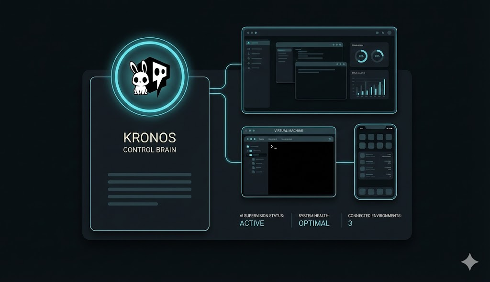

<div align="center">


# KRONOS Unified Automation Platform

**Unified Desktop Interface**

*Comprehensive Electron application for managing KRONOS AI computer automation projects*

[](LICENSE)
[](https://github.com/yourusername/ai-emulators)

</div>

---

A comprehensive Electron desktop application for managing KRONOS AI computer automation projects with a unified interface.

<div align="center">



*The central control interface for all KRONOS AI automation components*

</div>

---

## Overview

This platform provides a single Electron desktop interface for managing multiple AI automation projects including:
- open-computer-use
- UI-TARS-desktop
- gbox
- bytebot
- ai-browser
- instagrapi
- instapy
- n8n
- ollama
- onlysnarf
- pytube
- solana
- tiktok_api
- tiktokpy

## Features

- **Project Management**: Unified interface for creating, configuring, and managing AI automation projects
- **Task Monitoring**: Real-time task execution with progress tracking and logging
- **Authentication Management**: Multi-platform authentication with secure credential storage
- **System Monitoring**: Real-time system resource monitoring and health checks
- **WebSocket Integration**: Real-time communication between components
- **Process Management**: System-level process monitoring and control

## Architecture

### Phase 1: Core Electron Infrastructure ✅
- [x] Package.json configuration
- [x] Main Electron process with IPC
- [x] Secure preload script
- [x] ProjectManager service
- [x] ProcessMonitor service  
- [x] WebSocketManager service
- [x] AuthManager service
- [x] React frontend integration (index.js, App.js, CSS files)
- [x] React components (Header, ProjectManager, TaskMonitor, AuthManager, SystemMonitor, LoadingSpinner, ErrorBoundary, StatusBar)
- [x] Verify IPC communication between main process and React renderer
- [x] Test complete application flow and component integration

### Phase 2: Configuration and Type Definitions ✅
- [x] TypeScript configuration (tsconfig.json)
- [x] Project types (src/types/project.ts)
- [x] Task types (src/types/task.ts)
- [x] Authentication types (src/types/auth.ts)
- [x] System monitoring types (src/types/system.ts)
- [x] API and WebSocket types (src/types/api.ts)
- [x] React component types (src/types/components.ts)
- [x] Service layer types (src/types/services.ts)
- [x] Electron-specific types (src/types/electron.ts)
- [x] Type exports and barrel files (src/types/index.ts)

### Phase 3: Service Management Layer Implementation (Current)
- [ ] Service registry and lifecycle management
- [ ] Dependency injection system
- [ ] Service health monitoring
- [ ] Configuration management
- [ ] Service discovery and load balancing

### Phase 4: API Abstraction Layer Creation
- [ ] REST API client with TypeScript
- [ ] WebSocket client implementation
- [ ] Request/response validation
- [ ] Error handling and retry logic
- [ ] Authentication middleware

### Phase 5: Real-time Streaming Implementation
- [ ] WebSocket streaming infrastructure
- [ ] Event-driven architecture
- [ ] Message queue system
- [ ] Real-time updates and notifications
- [ ] Data synchronization

### Phase 6: Core UI Components Development
- [ ] Enhanced React components with TypeScript
- [ ] Responsive design system
- [ ] Accessibility features
- [ ] Internationalization support
- [ ] Advanced data visualization

### Phase 7: Integration, Testing, and Documentation
- [ ] End-to-end testing suite
- [ ] Performance optimization
- [ ] Security audit and hardening
- [ ] User documentation
- [ ] Developer documentation

## Project Structure

```
unified-automation-platform/
├── src/
│   ├── main/                 # Electron main process
│   │   ├── kronos-main.js    # Main process entry point
│   │   ├── preload.js       # Secure IPC bridge
│   │   └── services/        # Main process services
│   │       ├── project-manager.js
│   │       ├── process-monitor.js
│   │       ├── websocket-manager.js
│   │       └── auth-manager.js
│   ├── renderer/            # React renderer process
│   │   ├── index.js         # React entry point
│   │   ├── App.js           # Main React component
│   │   ├── index.css        # Global styles
│   │   ├── App.css          # App-specific styles
│   │   └── components/      # React components
│   │       ├── Header.js
│   │       ├── ProjectManager.js
│   │       ├── TaskMonitor.js
│   │       ├── AuthManager.js
│   │       ├── SystemMonitor.js
│   │       ├── LoadingSpinner.js
│   │       ├── ErrorBoundary.js
│   │       └── StatusBar.js
│   └── types/               # TypeScript type definitions
│       ├── index.ts
│       ├── project.ts
│       ├── task.ts
│       ├── auth.ts
│       ├── system.ts
│       ├── api.ts
│       ├── components.ts
│       ├── services.ts
│       └── electron.ts
├── public/
│   └── index.html           # HTML template
├── package.json
├── tsconfig.json
└── README.md
```

## Development

### Prerequisites
- Node.js 18+
- npm or yarn
- TypeScript 5+

### Installation
```bash
cd unified-automation-platform
npm install
```

### Development Commands
```bash
# Start development server
npm run dev

# Build for production
npm run build

# Type checking
npm run type-check

# Lint code
npm run lint

# Format code
npm run format
```

## Technology Stack

- **Desktop Framework**: Electron 28+
- **Frontend Framework**: React 18+
- **Language**: TypeScript 5+
- **Build Tools**: Webpack, Babel
- **State Management**: React Context API
- **Styling**: CSS3 with CSS Modules
- **Development Tools**: ESLint, Prettier, Jest

## Contributing

1. Follow the established project structure
2. Use TypeScript for all new code
3. Maintain type safety throughout
4. Write comprehensive tests
5. Follow the coding standards defined in .eslintrc.js

## License

This project is licensed under the MIT License.
